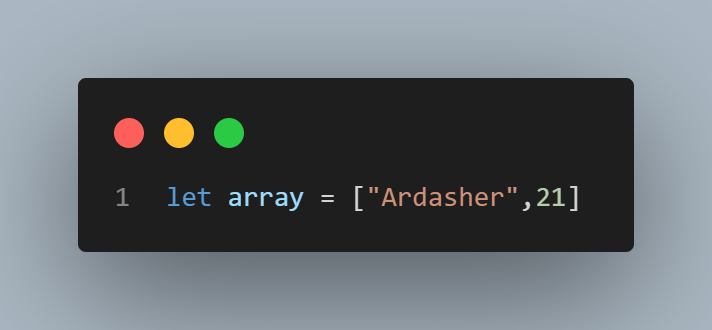
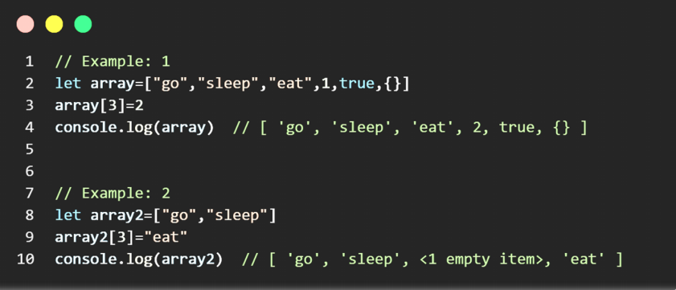
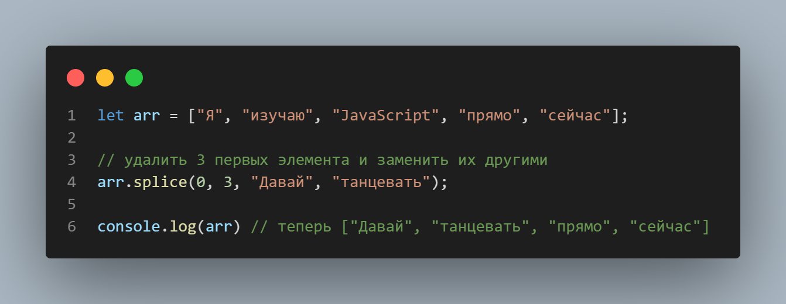
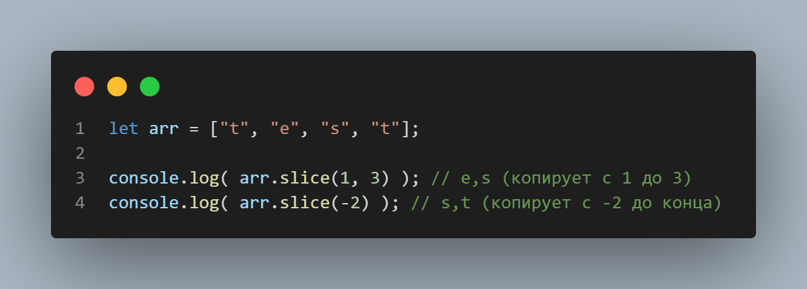
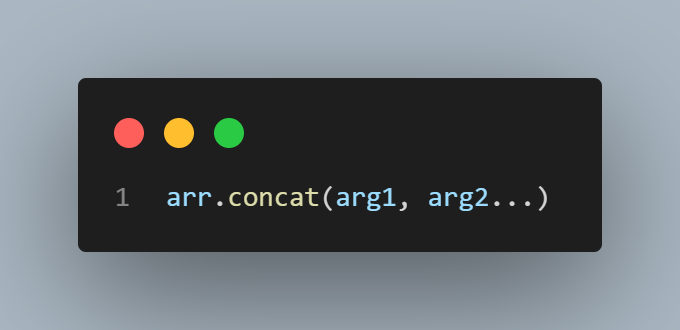
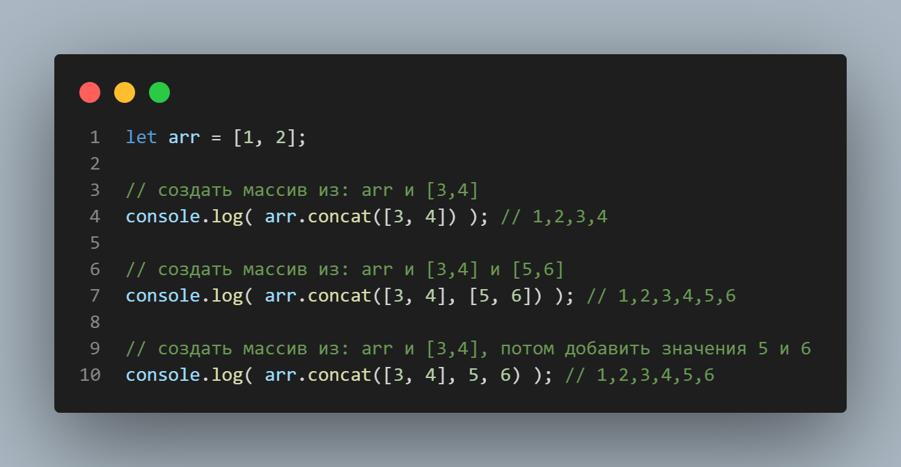
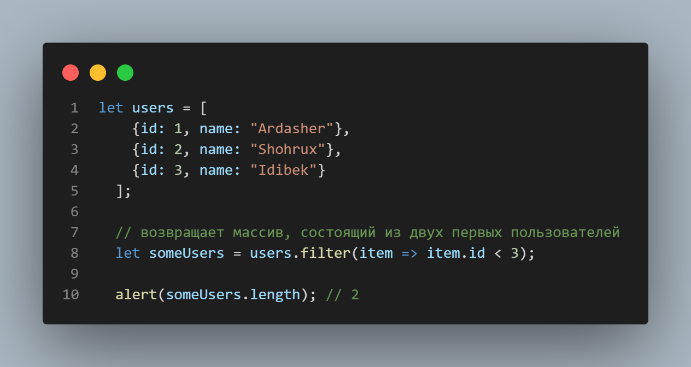
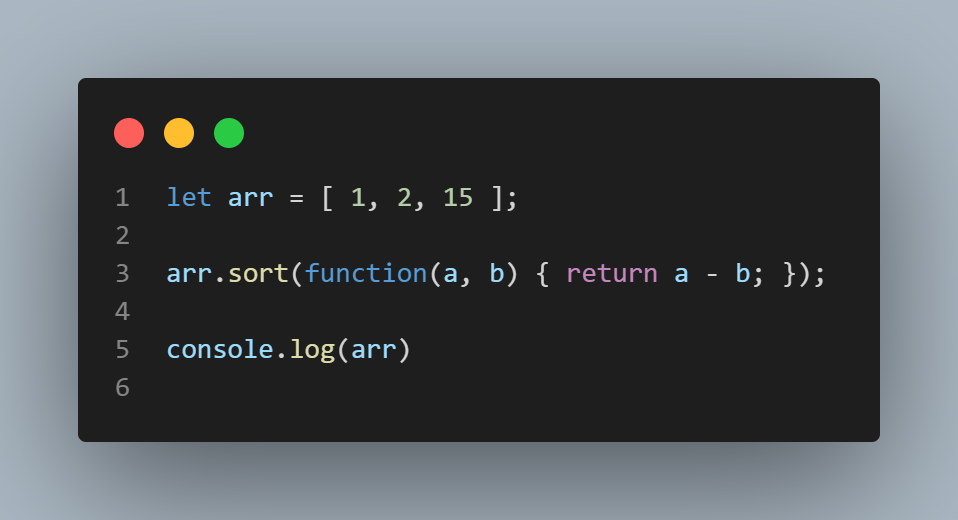

# Array-spread-Rest

## What is Array in JavaScript?

**Массив — это объект, который содержит значения (любого типа), особенно в именованных свойствах/ключах, а скорее в позиции с числовым индексом.**

В JavaScript массив — это упорядоченный список значений. Каждое значение называется элементом, указанным индекс. ... Во-первых, массив может содержать значения смешанных типов.

**Массив — это специальная переменная, которая может содержать более одного значения**

**Creating an Array**
1. Использование литерала массива

2. Использование нового ключевого слова

**ИЗМЕНИТЬ ЭЛЕМЕНТЫ В МАССИВЕ**

Вы также можете добавлять элементы или изменять элементы, обращаясь к значению индекса
Предположим, массив состоит из двух элементов. Если вы попытаетесь добавить элемент с индексом 3 (четвертый
element), третий элемент будет неопределенным.

**Методы массивов**
Массивы предоставляют множество методов. Чтобы было проще, в этой главе они разбиты на группы.

**Добавление/удаление элементов**
Мы уже знаем методы, которые добавляют и удаляют элементы из начала или конца:

1. arr.push(...items) – добавляет элементы в конец,
2. arr.pop() – извлекает элемент из конца,
3. arr.shift() – извлекает элемент из начала,
4. arr.unshift(...items) – добавляет элементы в начало
****
**splice**
Метод arr.splice(str) – это универсальный «швейцарский нож» для работы с массивами. Умеет всё: добавлять, удалять и заменять элементы.

Синтаксис:

**arr.splice(start[, deleteCount, elem1, ..., elemN])**

Он изменяет arr начиная с индекса start: удаляет deleteCount элементов и затем вставляет elem1, ..., elemN на их место. Возвращает массив из удалённых элементов

***В следующем примере мы удалим 3 элемента и заменим их двумя другими.***

***Метод splice также может вставлять элементы без удаления, для этого достаточно установить deleteCount в 0:***

****
**slice**

Метод arr.slice намного проще, чем похожий на него arr.splice.

**Синтаксис:**
**arr.slice([start], [end])**

Он возвращает новый массив, в который копирует все элементы с индекса start до end (не включая end). start и end могут быть отрицательными, в этом случае отсчёт позиции будет вестись с конца массива.

Это похоже на строковый метод str.slice, но вместо подстрок возвращает подмассивы.

Можно вызвать slice без аргументов: arr.slice() создаёт копию arr. Это часто используют, чтобы создать копию массива для дальнейших преобразований, которые не должны менять исходный массив.

****
**concat**

Метод arr.concat создаёт новый массив, в который копирует данные из других массивов и дополнительные значения

**Синтаксис:**

В результате – новый массив, включающий в себя элементы из arr, затем arg1, arg2 и так далее.

Если аргумент argN – массив, то копируются все его элементы. Иначе копируется сам аргумент.

Например:

****
***Перебор: forEach***

**Метод arr.forEach позволяет запускать функцию для каждого элемента массива.**

***Синтаксис:***

arr.forEach(function(item, index, array) {
  // ... делать что-то с item
})

****

**Filter**
Метод find ищет один (первый) элемент, который заставит функцию вернуть true.

Если найденных элементов может быть много, можно использовать arr.filter(fn).

Синтаксис схож с find, но filter возвращает массив из всех подходящих элементов:

let results = arr.filter(function(item, index, array) {
  // если `true` -- элемент добавляется к results и перебор продолжается
  // возвращается пустой массив в случае, если ничего не найдено
});

****

**Map**
Метод arr.map является одним из наиболее полезных и часто используемых.

Он вызывает функцию для каждого элемента массива и возвращает массив результатов выполнения этой функции.

***Синтаксис:***

let result = arr.map(function(item, index, array) {
  // возвращается новое значение вместо элемента
});

Например, здесь мы преобразуем каждый элемент в его длину:

****
**sort(fn)**

Вызов arr.sort() сортирует массив на месте, меняя в нём порядок элементов.

Он также возвращает отсортированный массив, но обычно возвращаемое значение игнорируется, так как изменяется сам arr.

**split и join**

Ситуация из реальной жизни. Мы пишем приложение для обмена сообщениями, и посетитель вводит имена тех, кому его отправить, через запятую: Вася, Петя, Маша. Но нам-то гораздо удобнее работать с массивом имён, чем с одной строкой. Как его получить?

Метод str.split(delim) именно это и делает. Он разбивает строку на массив по заданному разделителю delim.

В примере ниже таким разделителем является строка из запятой и пробела.

****
**reduce/reduceRight**

Когда нам нужно перебрать массив – мы можем использовать forEach, for или for..of.

Когда нам нужно перебрать массив и вернуть данные для каждого элемента – мы можем использовать map.

Методы arr.reduce и arr.reduceRight похожи на методы выше, но они немного сложнее. Они используются для вычисления единого значения на основе всего массива.

**Синтаксис:**
let value = arr.reduce(function(accumulator, item, index, array) {
  // ...
}, [initial]);

Функция применяется по очереди ко всем элементам массива и «переносит» свой результат на следующий вызов.

***Итого***
Шпаргалка по методам массива:

Для добавления/удаления элементов:

**push (...items)** – добавляет элементы в конец,
**pop()** – извлекает элемент с конца,
**shift()** – извлекает элемент с начала,
**unshift(...items)** – добавляет элементы в начало.
**splice(pos, deleteCount, ...items)** – начиная с индекса pos удаляет deleteCount элементов и вставляет items.
**slice(start, end)** – создаёт новый массив, копируя в него элементы с индекса start до end (не включая end).
**concat(...items)** – возвращает новый массив: копирует все члены текущего массива и добавляет к нему items. Если какой-то из items является массивом, тогда берутся его элементы.
Для поиска среди элементов:

**indexOf/lastIndexOf(item, pos)** – ищет item, начиная с позиции pos, и возвращает его индекс или -1, если ничего не найдено.
**includes(value)** – возвращает true, если в массиве имеется элемент value, в противном случае false.
**find/filter(func)** – фильтрует элементы через функцию и отдаёт первое/все значения, при прохождении которых через функцию возвращается true.
**findIndex** похож на find, но возвращает индекс вместо значения.
Для перебора элементов:

**forEach(func)** – вызывает func для каждого элемента. Ничего не возвращает.
Для преобразования массива:

**map(func)** – создаёт новый массив из результатов вызова func для каждого элемента.
**sort(func)** – сортирует массив «на месте», а потом возвращает его.
**reverse()** – «на месте» меняет порядок следования элементов на противоположный и возвращает изменённый массив.
**split/join** – преобразует строку в массив и обратно.
**reduce/reduceRight(func, initial)** – вычисляет одно значение на основе всего массива, вызывая func для каждого элемента и передавая промежуточный результат между вызовами.
Дополнительно:

**Array.isArray(arr)** проверяет, является ли arr массивом.
Пожалуйста, обратите внимание, что методы sort, reverse и splice изменяют исходный массив.

Эти методы – самые используемые, их достаточно в 99% случаев. Но существуют и другие:

arr.some(fn)/arr.every(fn) проверяет массив.

Функция fn вызывается для каждого элемента массива аналогично map. Если какие-либо/все результаты вызовов являются true, то метод возвращает true, иначе false.

Эти методы ведут себя примерно так же, как операторы || и &&: если fn возвращает истинное значение, arr.some() немедленно возвращает true и останавливает перебор остальных элементов; если fn возвращает ложное значение, arr.every() немедленно возвращает false и также прекращает перебор остальных элементов.
